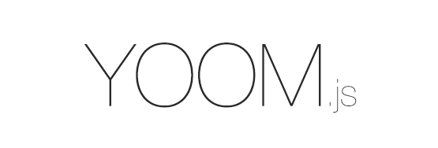

<div style="text-align: center; padding-bottom: 20px">



[](http://badge.fury.io/js/yoom)
[](https://gemnasium.com/xpepermint/yoomjs)
</div>


# YoomJS - MVC Framework for NodeJS

YoomJS is a next generation web framework for [NodeJS](http://nodejs.org/) built on top of [KoaJS](http://koajs.com/). YoomJS mimics the MVC pattern of frameworks like [Ruby on Rails](http://rubyonrails.org/) which makes writing custom, enterprise-grade [NodeJS](http://nodejs.org/) applications fast and enjoyable.

## Installation

### Dependencies

Make sure that [NodeJS](http://nodejs.org/) version `0.11.13` or later is installed. You can easily installing a fresh version of [NodeJS](http://nodejs.org/) using the [Node Version Manager](https://github.com/creationix/nvm).

You also need [Bower](http://www.bowserjs.org/) and [Gulp](http://gulpjs.com/) commands available from the command-line.

### Yoom

Install the package.

```
npm install -g yoom
```

After the installation the `yoom` command-line script will be available. Run `yoom --help` to see the list of available commands.

### Create New Project

Use the `yoom` command to create a new application directory structure.

``` javascript
yoom new {project-path}
```

From `{project-path}` start the application server.

``` javascript
yoom start
```

You can also run open the application in your default browser.

``` javascript
yoom open
```

The project is ready and you can start building your next generation web application, API, or website.

## Donate

Please support us if you like this project.

[](https://www.gittip.com/xpepermint/)
[](https://flattr.com/submit/auto?user_id=Xpepermint&url=https://github.com/xpepermint/yoomjs&title=YoomJS&tags=github&category=software)


<!--

## TO-DO / NOTES

* Run Multiple HTTP instances: http://koajs.com/#app-listen-
* Node cluster
* Cookies & session: http://koajs.com/#app-keys-
* Logging: http://koajs.com/#error-handling (winston)
* HowTo KoaJS: https://github.com/koajs/examples, https://github.com/koajs/workshop
* Nginx as proxy
* doc: https://readthedocs.org/
* deployment: https://www.npmjs.org/package/forever
* deploy to heroku
* video doc like https://github.com/floatdrop/gulp-watch
* every task returns stream
* funding https://pledgie.com/

## Features
* on top of express
* middlewares
* MVC
* models
* controllers
* routes
* multiple connectors
* settings
* mongodb with mongoose
* per-model database connection support
* command-line generators
* customize boot
* extend gulp task
* gulp: gulp {task}
* npm: npm install {package} --save
* bower: bower install {package} --save
* livereload: https://chrome.google.com/webstore/detail/livereload/jnihajbhpnppcggbcgedagnkighmdlei
* streams, gulp
* default assets coffee, less, lesshat
* extendable assets pipeline
-->
